[TOC]


##  流程图 


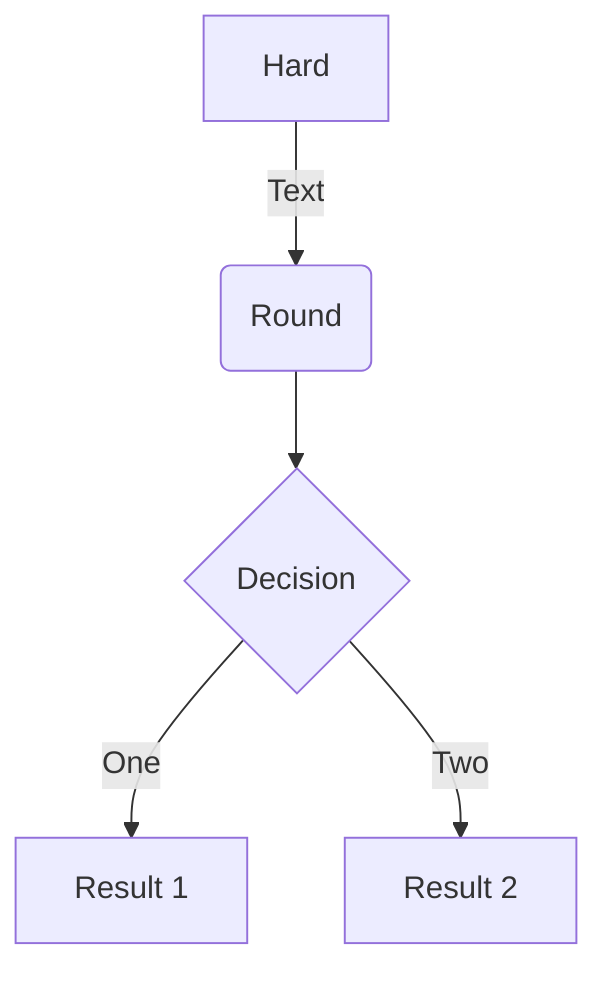
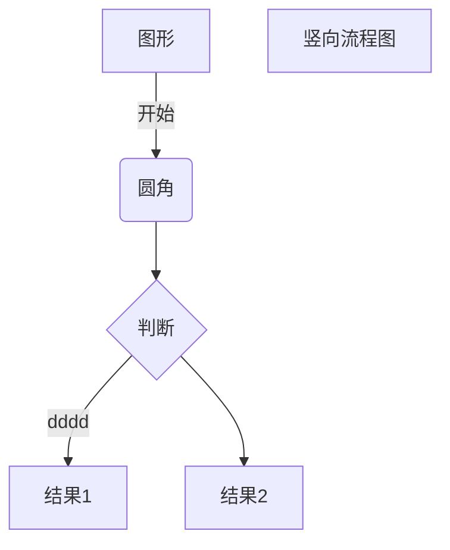


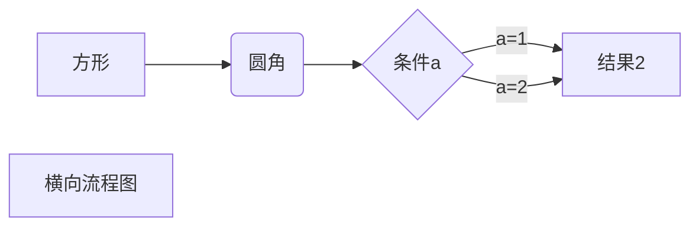
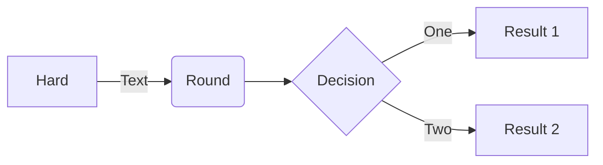


## 时序图

```
sequenceDiagram
Alice->>John: Hello John, how are you?
loop Healthcheck
    John->>John: Fight against hypochondria
end
Note right of John: Rational thoughts!
John-->>Alice: Great!
John->>Bob: How about you?
Bob-->>John: Jolly good!
```
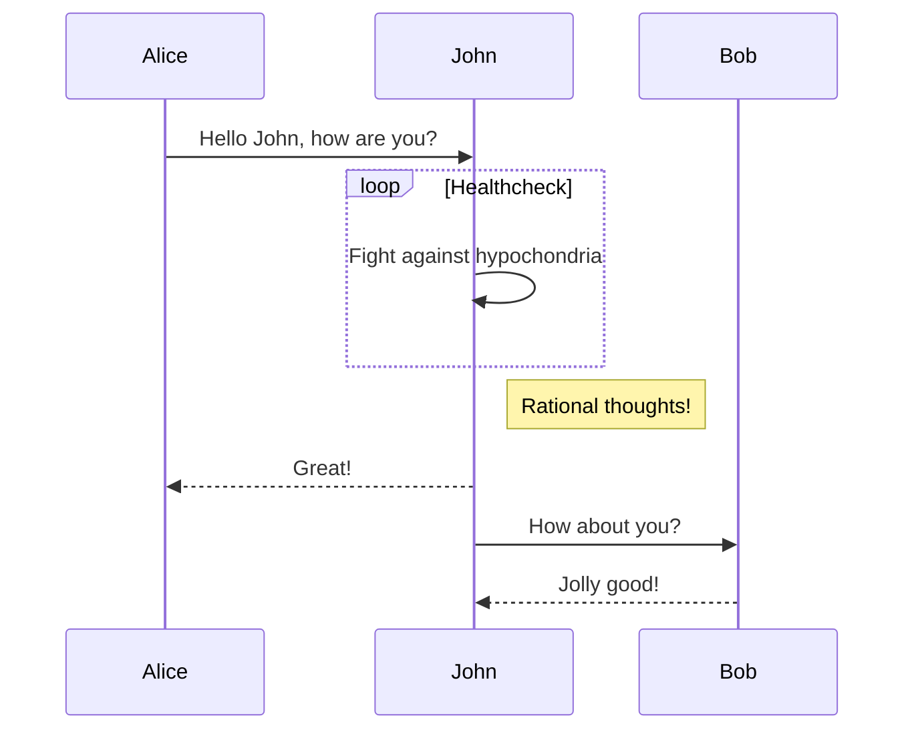


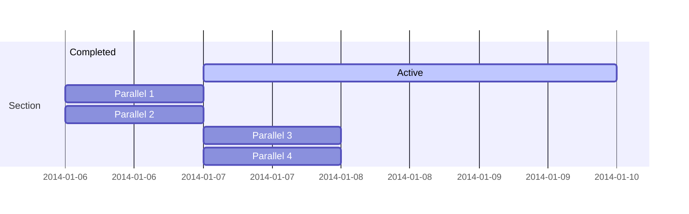


## 甘特图

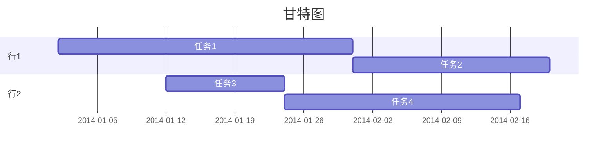
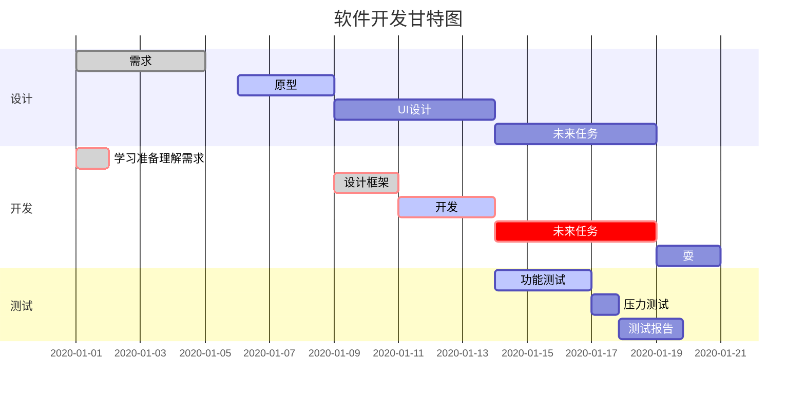


## 类图
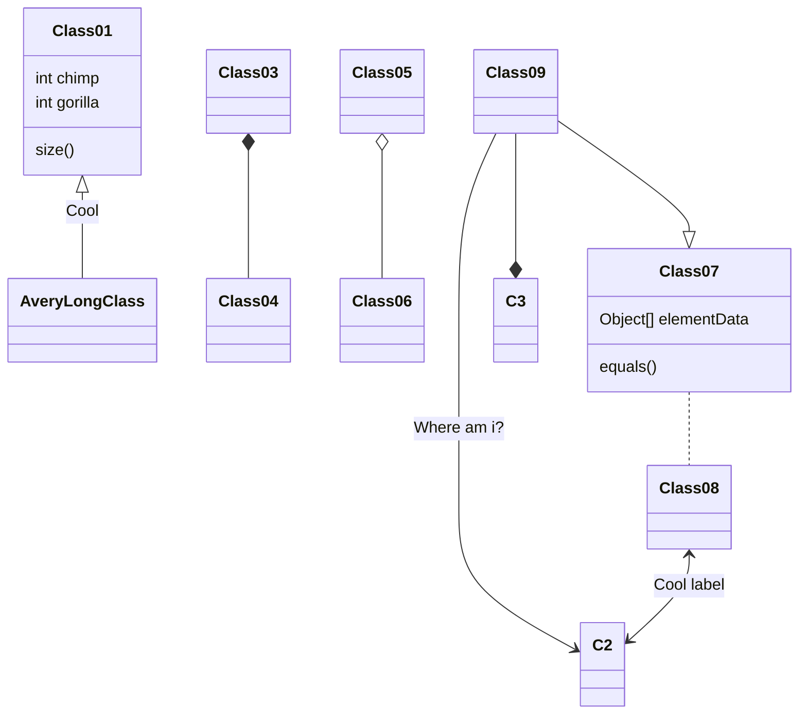
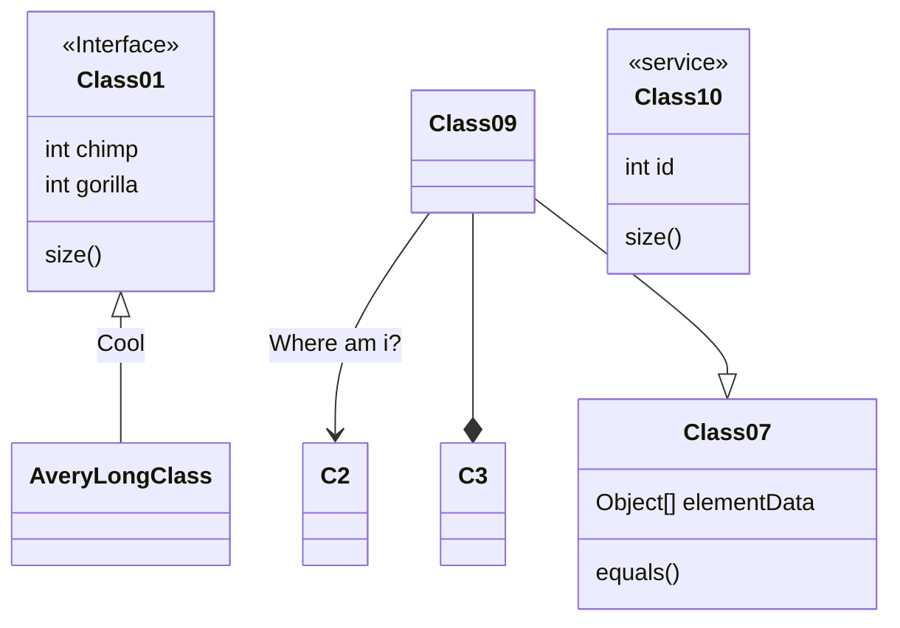

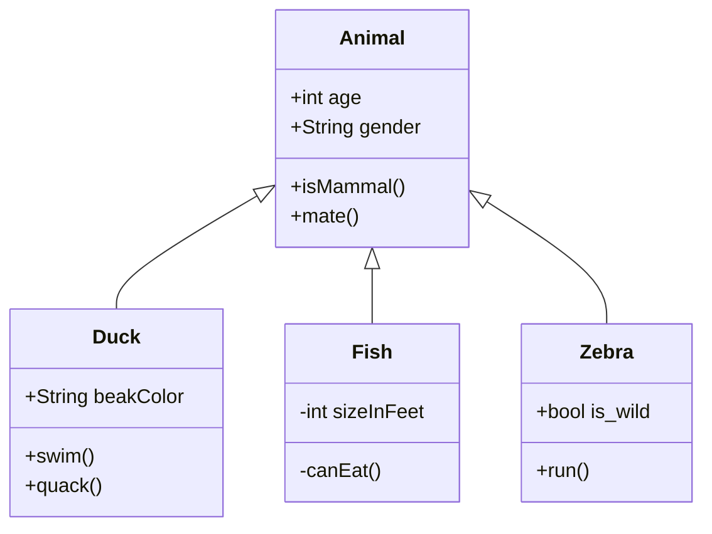

## 状态图 

```
stateDiagram-v2
[*] --> Still
Still --> [*]
Still --> Moving
Moving --> Still
Moving --> Crash
Crash --> [*]
```
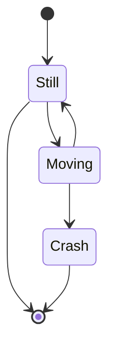

## 饼图

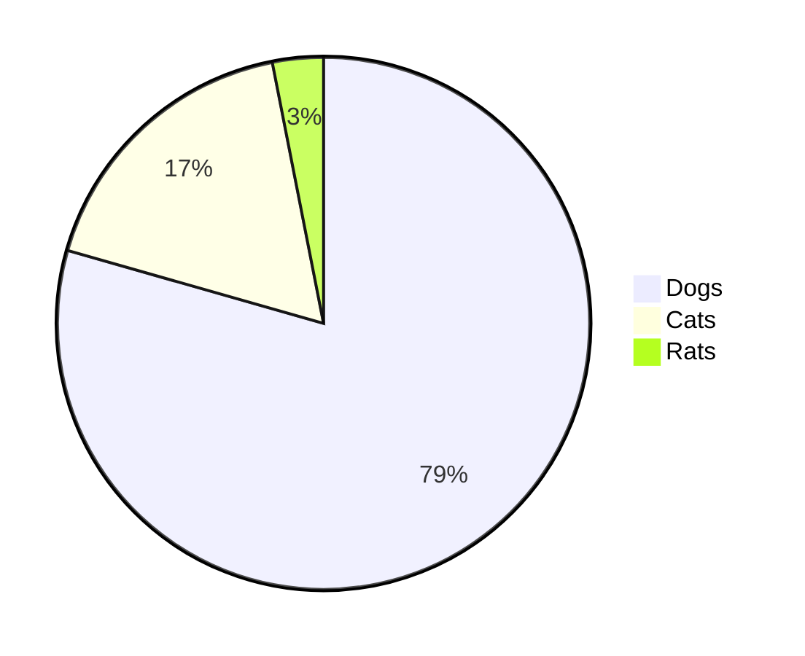

## Git图


## 用户体验旅程图 

```
  journey
    title My working day
    section Go to work
      Make tea: 5: Me
      Go upstairs: 3: Me
      Do work: 1: Me, Cat
    section Go home
      Go downstairs: 5: Me
      Sit down: 3: Me
```
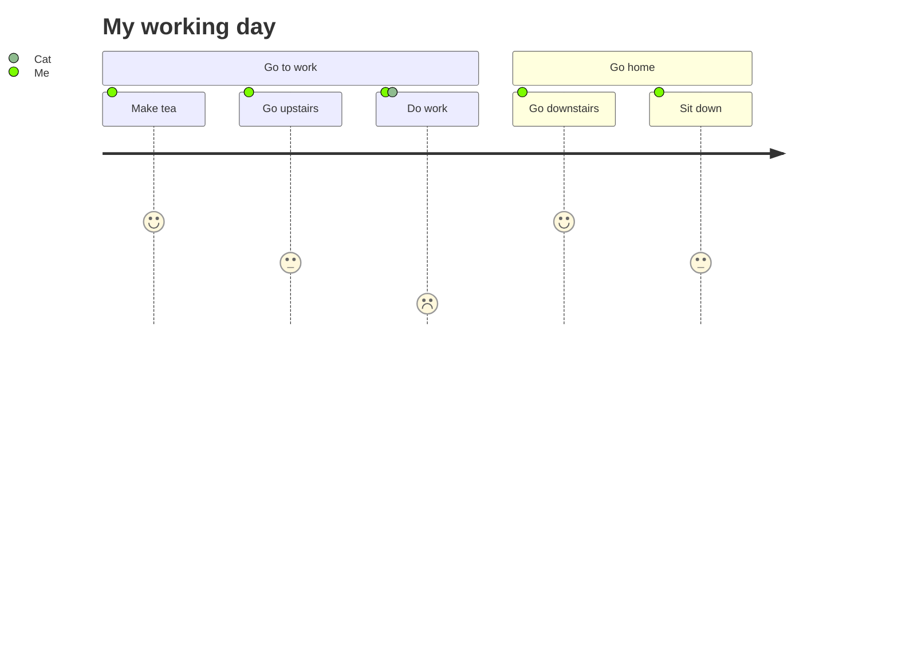


---

>   *Mermaid 是由 Knut Sveidqvist 创建，它为了更简单的文档编写而生。*

https://www.cnblogs.com/xdy-/p/13402709.html